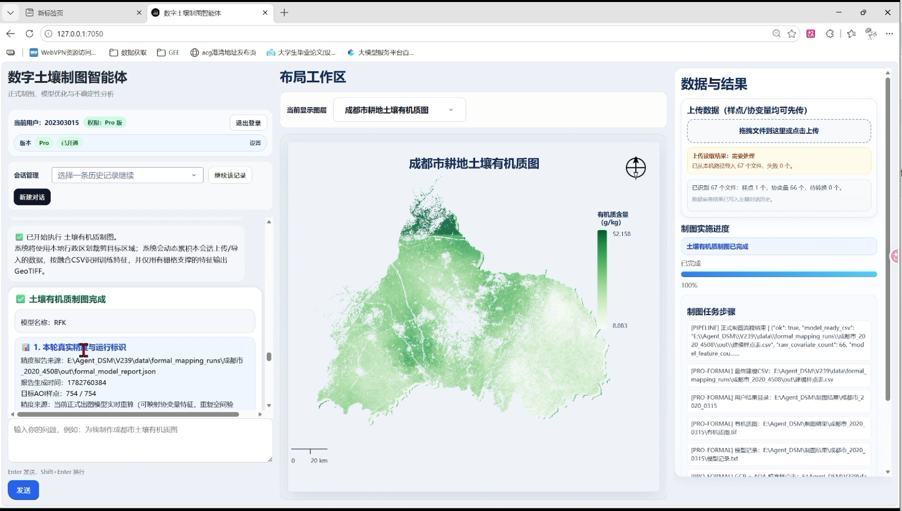
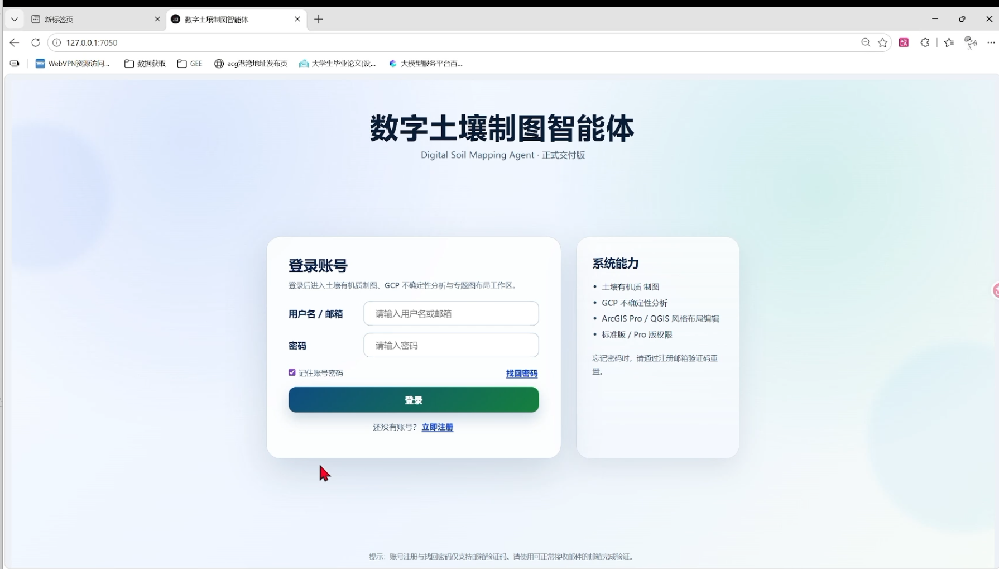
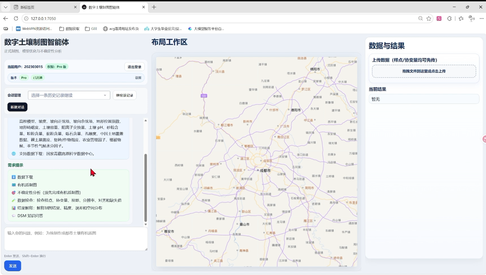
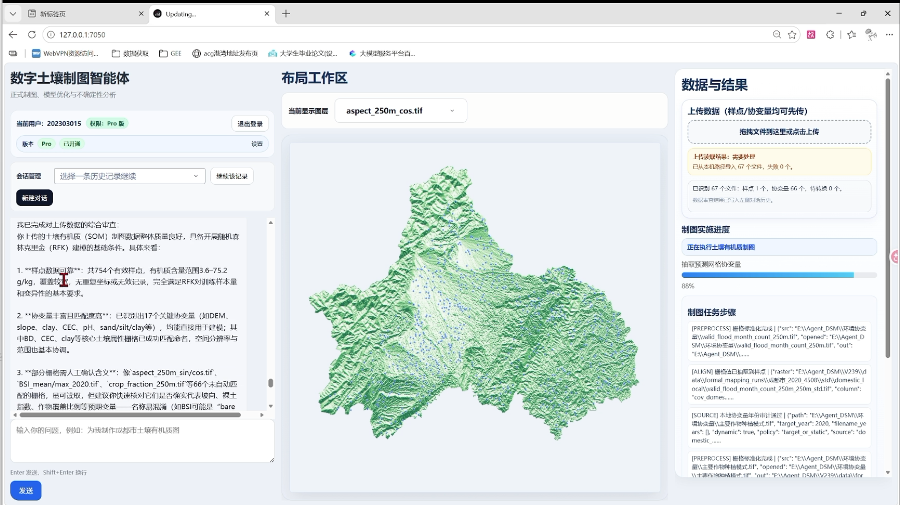

# Agent_DSM
面向数字土壤制图的土壤有机质智能体，一站式完成环境数据获取、样点处理、建模预测、有机质空间制图与不确定性分析，自带可视化交互界面，降低土壤数字制图的操作门槛。
## 项目演示
B站演示: [【数字土壤制图智能体演示】](https://www.bilibili.com/video/BV1mue867EKy/?share_source=copy_web&vd_source=7b1d7a1ee3ff37d1e3ef1c79c48510e3)
### 登录页面

### 交互工作区

### 制图运算过程

### 最终制图成果

## 功能特性
- 环境协变量数据自动下载
- 土壤采样点数据清洗、坐标校验、样本筛选
- 环境因子相关性分析与特征推荐
- 土壤有机质机器学习建模与空间预测
- 栅格制图、结果可视化与不确定性评估
- 可视化UI界面，支持参数配置与成果导出
## 目录结构
- Agent_DSM/
  - assets：静态资源、图像素材
  - config：项目配置文件
  - core：核心算法模块
  - models：模型定义、训练与存储
  - services：业务逻辑服务
  - tools：辅助工具脚本
  - ui：交互界面相关代码
  - utils：通用工具函数
  - app.py：程序入口
  - layout_editor.js
## 特别说明
- 智能体API为千问，需要在.env文件配置API
- 数据下载，采用的是国家青藏高原数据中心，需自配账号密码，采用FTP下载，软件为FileZilla Client
- 用户需自备采样点数据，csv格式，需要自备行政区划实验区等数据，可自备环境协变量数据（常见格式均支持，如tif，NC）
- 制图模型为RFK，不确定性分析采用地理共性预测（GCP）+AOA适用域分析
- 用户需自行配置.env文件，包括API，账号密码，数据位置
- 用户需要自行配置Python，推荐 Python 3.9 ~ 3.11
- 启动直接运行app.py
##  环境依赖
项目使用Conda管理环境
# 根据yml文件一键创建环境
conda env create -f environment.yml
# 激活环境
conda activate geo_env
